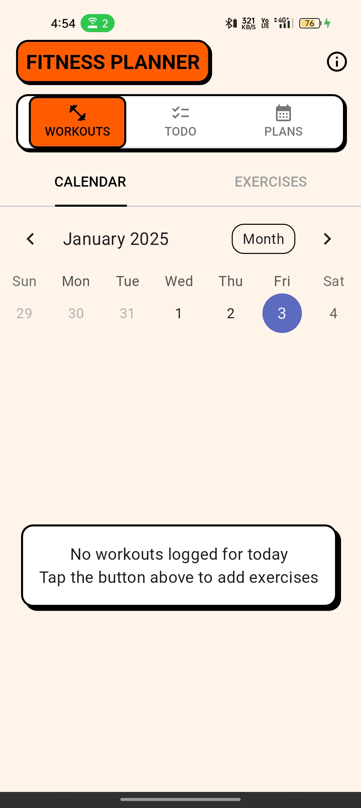
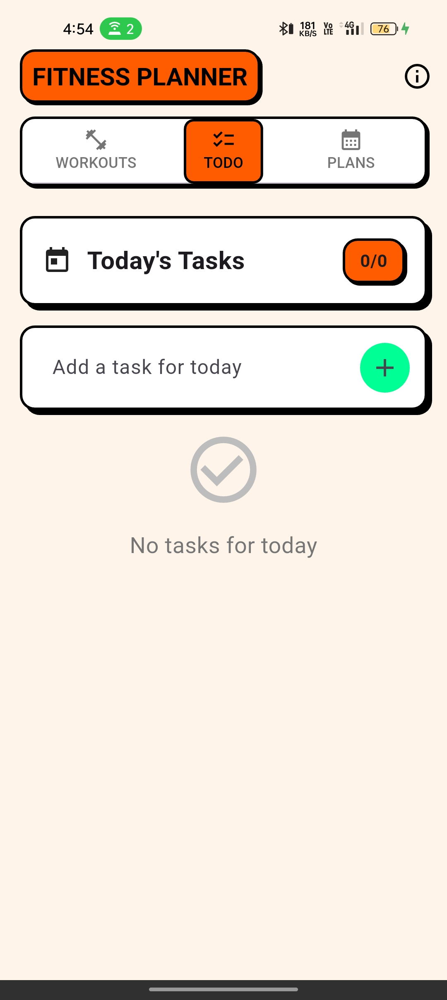
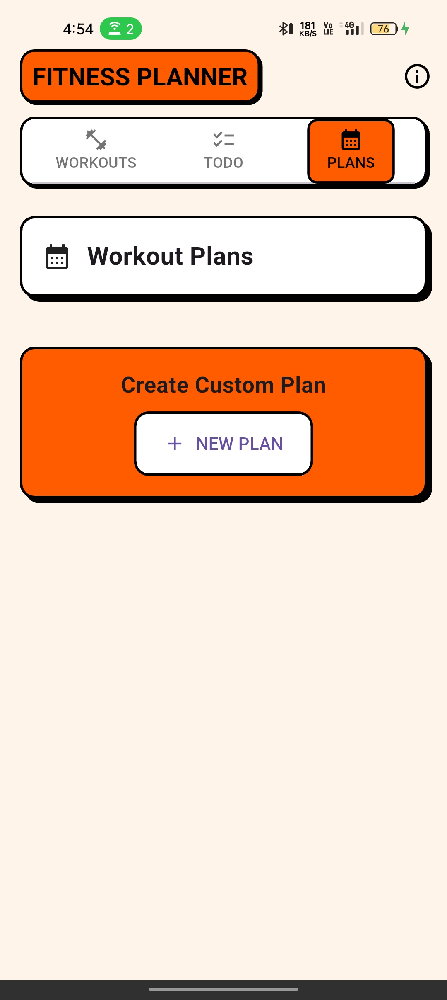

# Tozen: Your Fitness Companion

Tozen is a comprehensive fitness planning application designed to help you achieve your fitness goals. It offers a clean and intuitive interface to track your workouts, manage your to-do lists, and plan your fitness journey.

## Key Features

- **Workout Tracking:** Log your workouts easily with detailed tracking capabilities.
- **Task Management:** Create and manage your daily tasks to stay organized and focused.
- **Fitness Planning:** Plan your workouts and fitness goals over time with customizable workout plans.

## Screenshots

Here's a glimpse into the Tozen experience:

## Getting Started

This project is a starting point for a Flutter application. To get started with Tozen, follow these steps:

1. **Clone the repository:** `git clone <repository_url>`
2. **Navigate to the project directory:** `cd tozen`
3. **Install dependencies:** `flutter pub get`
4. **Run the app:** `flutter run`

## Technology Stack

- Flutter
- Dart

## Contributing

Contributions are welcome! Please feel free to open issues or submit pull requests.

## License

MIT License

Copyright (c) 2025 CipheBloom

Permission is hereby granted, free of charge, to any person obtaining a copy
of this software and associated documentation files (the "Software"), to deal
in the Software without restriction, including without limitation the rights
to use, copy, modify, merge, publish, distribute, sublicense, and/or sell
copies of the Software, and to permit persons to whom the Software is
furnished to do so, subject to the following conditions:

The above copyright notice and this permission notice shall be included in all
copies or substantial portions of the Software.

THE SOFTWARE IS PROVIDED "AS IS", WITHOUT WARRANTY OF ANY KIND, EXPRESS OR
IMPLIED, INCLUDING BUT NOT LIMITED TO THE WARRANTIES OF MERCHANTABILITY,
FITNESS FOR A PARTICULAR PURPOSE AND NONINFRINGEMENT. IN NO EVENT SHALL THE
AUTHORS OR COPYRIGHT HOLDERS BE LIABLE FOR ANY CLAIM, DAMAGES OR OTHER
LIABILITY, WHETHER IN AN ACTION OF CONTRACT, TORT OR OTHERWISE, ARISING FROM,
OUT OF OR IN CONNECTION WITH THE SOFTWARE OR THE USE OR OTHER DEALINGS IN THE
SOFTWARE.
